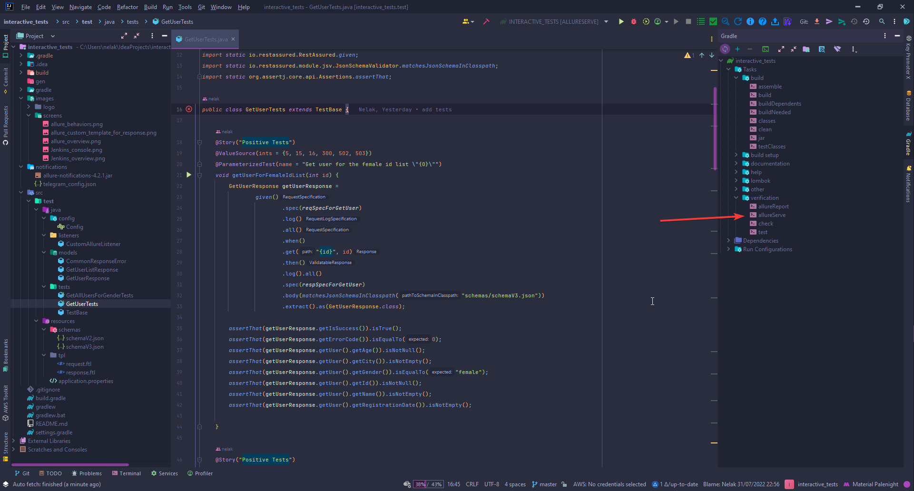
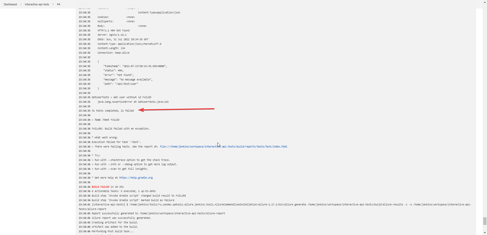

# API TESTS FOR INTERACTIVE

### Used Technologies & Tools:
<p align="left">


</p>

### Swagger as a REST API Service Self-Documentation:
Swagger is available on by [link](https://hr-challenge.interactivestandard.com/v3/swagger-ui/index.html?configUrl=%2Fv3%2Fapi-docs%2Fswagger-config&urls.primaryName=QA#/qa-test-controller)

### Autotests coverage next handlers:
- [X] Get user
- [X] Get user list

### How To Run Tests </br>
```bash
gradle clean test
```
### Allure Report For Test Results Presentation
#### How to Run Allure Report
After tests are executed run the following command at Terminal
```bash
gradle allureServe
```
or run report using GUI


### Allure Report Results
[REPORT](https://jenkins.autotests.cloud/job/interactive-api-tests/4/allure/)


### Custom template for API Report


### Jenkins build
[BUILD](https://jenkins.autotests.cloud/job/interactive-api-tests/4/)


